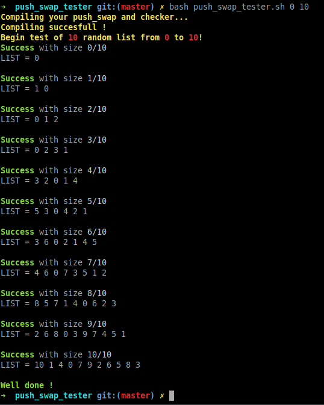
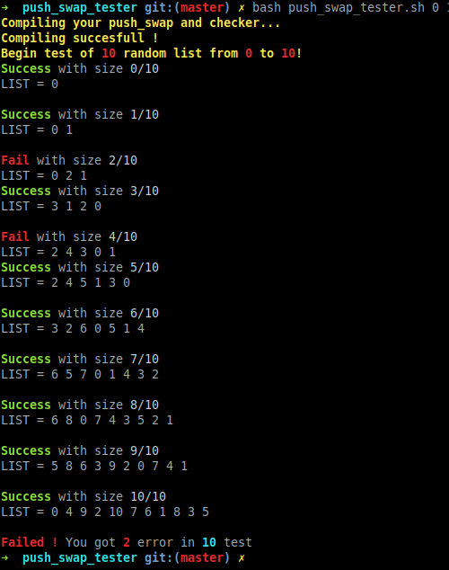

# **Push_swap_tester:** 
## Requirement:
You must be on a Linux distribution.
## Usage:
1) Clone this repository in your project folder.
2) Enter in the new repository you just cloned.
3) Launch : "bash push_swap_tester.sh" for all test

`Exemple: bash push_swap_tester.sh`

4) Specify the range of your test with start and end param !

`Exemple: bash push_swap_tester.sh 0 100`

***Be careful, this tester doesnt test the Norm !***
# **All test good** 

# **If you have an error** 

